  <picture>
    <source media="(prefers-color-scheme: dark)" srcset="assets/hero-dark.svg">
    <source media="(prefers-color-scheme: light)" srcset="assets/hero-light.svg">
    
  </picture>

  <a href="https://bumbletap.com"><b>BumbleTap</b></a>
  &nbsp;·&nbsp;
  <a href="https://github.com/umershahzeb02/umershahzeb02/blob/main/Shahzeb-Umer-Resume.pdf">Résumé</a>
  &nbsp;·&nbsp;
  <a href="https://linkedin.com/in/umershahzeb">LinkedIn</a>
  &nbsp;·&nbsp;
  <a href="https://medium.com/@umershahzeb">Medium</a>
  &nbsp;·&nbsp;
  <a href="https://umershahzeb02.github.io/my-portfolio/">Portfolio</a>
  &nbsp;·&nbsp;
  <a href="mailto:umershahzeb@gmail.com">Email</a>

 

> I pick the stack to fit the problem rather than the other way round. So far that has meant
> browser internals, multimodal AI systems, production platforms at scale, infrastructure, and
> a fair amount of algorithmic work. 

Currently **Full Stack Developer** at the **Directorate of ICT, Allama Iqbal Open University**,
shipping public and internal platforms for an institution serving 400,000+ students nationwide.
Always looking for the next unfamiliar problem.

 

## Selected work

#### [BumbleTap](https://bumbletap.com)

`Browser internals` &nbsp; [Web Store ↗](https://chromewebstore.google.com/detail/bumbletap/djgihkldjjfolnbkccfophpgflekmhhd) &nbsp; [Engineering blog ↗](https://bumbletap.com/blog)

Binds arbitrary keystrokes to DOM actions on any website, built from two primitives: single-key
bindings — element invocation, text entry, sandboxed user JavaScript — and multi-step Auto-Actions
supporting conditional branching, waits, and variable extraction.

The hard problem is durability. Conventional CSS selectors break the moment a site redeploys, so
the element resolver identifies targets by multi-representation consensus and traverses shadow DOM,
keeping automations alive across deployments that would otherwise invalidate them. Privileged
execution is orchestrated across Chrome's isolated, main, and user-script worlds through a
cross-world messaging bridge, which buys CORS-exempt requests without giving up a strictly
client-side design — no backend, no telemetry.

**Manifest V3** · JavaScript · Next.js · Cloudflare Workers &amp; R2 · Vitest

 

#### [Lumen](https://github.com/umershahzeb02/lumen)

`Multimodal AI` &nbsp; `Retrieval`

Transcribes, summarises, and answers questions about video, using LLM APIs across text, audio, and
vision. A real-time streaming pipeline over WebSockets emits live progress events, with retry and
structured logging wrapped around every external call. The retrieval-augmented question-answering
path pulls from a vector store using embedding search and reranking, so answers stay grounded and
cite the timestamps they came from.

**Next.js** · FastAPI · WebSockets · Gemini &amp; OpenAI-compatible APIs · ChromaDB

 

#### Production platforms at AIOU

`Platforms at scale`

**[Islamic Research Index ↗](https://iri.aiou.edu.pk)** — a Next.js 14 research-indexing platform
hosting thousands of academic papers. Query optimisation and caching for page-load performance;
automated content-management workflows that cut manual indexing effort.

**[AIOU Bookstore ↗](https://bookstore.aiou.edu.pk)** — an e-commerce platform with secure payment
processing and a modular architecture spanning online sales, POS, warehouse, and notifications,
with inventory synchronised between the online store and physical outlets.

**HR Management System** *(internal)* — Node.js/Express and Next.js over PostgreSQL, covering
attendance, payroll, evaluations, and employee lifecycle, with role-based access control and
document storage in cloud object storage.

 

#### [pdf-to-json](https://github.com/umershahzeb02/pdf-to-json)

`Developer tooling` &nbsp; [Live ↗](https://pdf2json.vercel.app)

Converts PDF documents into structured JSON for downstream manipulation in web applications.

 

## Also exploring

Away from the web stack:
[genetic-algorithm timetable scheduling](https://github.com/umershahzeb02/Time-Table-Scheduling-with-Genetic-Algo--AI)
over a search space far too large to brute force,
[algorithm analysis](https://github.com/umershahzeb02/Analysis-of-Algos-Project) across problem
classes, a [console game built on hand-rolled data structures](https://github.com/umershahzeb02/Data-Structure-The-Quest-for-the-Crystal-Kingdom),
[transaction-focused DBMS design](https://github.com/umershahzeb02/Cafe-Management-System-DBMS) on
MS SQL Server, and smaller Python automation like
[price monitoring](https://github.com/umershahzeb02/price-monitor-system).

Coursework and curiosity in roughly equal measure — public because the range is the point.

 

## Writing

On browser internals, automation, infrastructure, and web architecture — at the
[BumbleTap engineering blog](https://bumbletap.com/blog) and on
[Medium](https://medium.com/@umershahzeb).

| | |
| --- | --- |
| [**Understanding Terraform**](https://medium.com/@umershahzeb/understanding-terraform-a-comprehensive-guide-to-infrastructure-automation-65f741c0762c) | Defining, provisioning, and managing cloud resources as code, and what it takes to keep infrastructure consistent across environments. |
| [**Mastering Prometheus**](https://medium.com/@umershahzeb/mastering-prometheus-a-comprehensive-guide-to-architecture-and-configuration-3522a852ea41) | The architecture and configuration of monitoring for distributed systems, from scrape design through alerting and scaling. |
| [**Are We Making DevOps Complicated?**](https://medium.com/@umershahzeb/are-we-making-devops-complicated-the-case-of-simplicity-in-tooling-54b5878b5d8a) | A case for minimalism in tooling, and why flexible toolchains so often become sprawl. |

 

## Stack

| | |
| --- | --- |
| **Languages** | TypeScript · JavaScript · Python · C++ · C# · SQL |
| **Backend** | Node.js · Express · FastAPI · REST APIs · WebSockets |
| **Frontend** | React · Next.js · React Native · Tailwind CSS |
| **Data** | PostgreSQL · MySQL · MongoDB · MS SQL Server · ChromaDB |
| **AI &amp; integration** | OpenAI-compatible &amp; Gemini APIs · RAG · embeddings · reranking |
| **Infrastructure** | Docker · Kubernetes · AWS · Cloudflare Workers &amp; R2 · Nginx · CI/CD |

 

  BS Computer Science, NUCES–FAST · 2021–2026 · Islamabad, Pakistan

